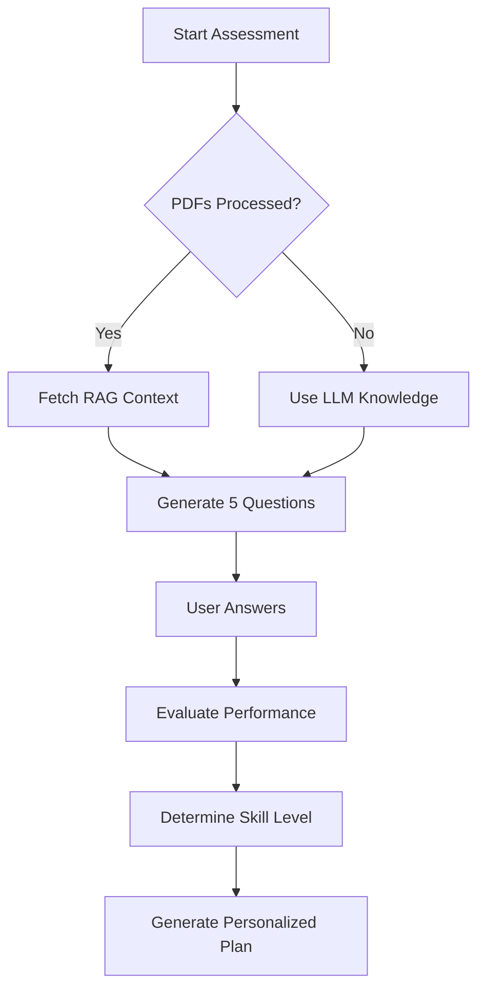

# 🎯 Adaptive Assessment & Personalized Learning

The AI Tutor now includes an **Adaptive Assessment System** that evaluates your skill level and creates a personalized study plan using your course PDFs.

## 🌟 Features

### 1. Diagnostic Quiz
- **Adaptive Questions**: Generates 5 questions with mixed difficulty:
  - 2 Beginner (Basic concepts)
  - 2 Intermediate (Application)
  - 1 Advanced (Complex scenarios)
- **RAG-Powered**: Questions are generated using content from your uploaded PDFs (if processed).
- **Context-Aware**: Tests knowledge specifically found in your course materials.

### 2. Skill Evaluation
- **Automatic Scoring**: Evaluates your answers instantly.
- **Level Determination**:
  - **Beginner**: Only basic questions correct.
  - **Intermediate**: Strong basics + some application.
  - **Advanced**: Mastery of all levels.
- **Detailed Feedback**: Identifies your strengths and areas for improvement.

### 3. Personalized Study Plan
- **Tailored Curriculum**: Creates a roadmap based on your specific skill level.
- **Focus Areas**: Targets your identified weaknesses while building on strengths.
- **RAG Integration**: Ensures the plan aligns with the actual content in your PDFs.

## 🚀 How to Use

1. **Navigate to Course Discovery**: Go to `http://localhost:5173/courses`.
2. **Select a Course**: Find the course you want to assess (e.g., Python).
3. **Process PDFs**: Ensure you've clicked "Process PDFs" so the system has knowledge.
4. **Take Quiz**: Click the **"Take Diagnostic Quiz"** button.
5. **Complete Assessment**: Answer the 5 questions.
6. **Get Results**: View your score, skill level, and feedback.
7. **Generate Plan**: Click "Generate Personalized Study Plan" to get your custom roadmap.

## 🔧 Technical Details

### API Endpoints

| Endpoint | Method | Purpose |
|----------|--------|---------|
| `/api/assessment/diagnostic-quiz` | POST | Generate adaptive quiz |
| `/api/assessment/evaluate` | POST | Evaluate answers & determine level |
| `/api/assessment/personalized-plan` | POST | Create custom study plan |

### Logic Flow

## 💡 Best Practices

- **Process PDFs First**: For the most relevant questions, always process the course PDFs before taking the quiz.
- **Be Honest**: Answer questions without looking up answers to get the most accurate study plan.
- **Review Feedback**: Pay attention to the "Focus Areas" identified in your results.
